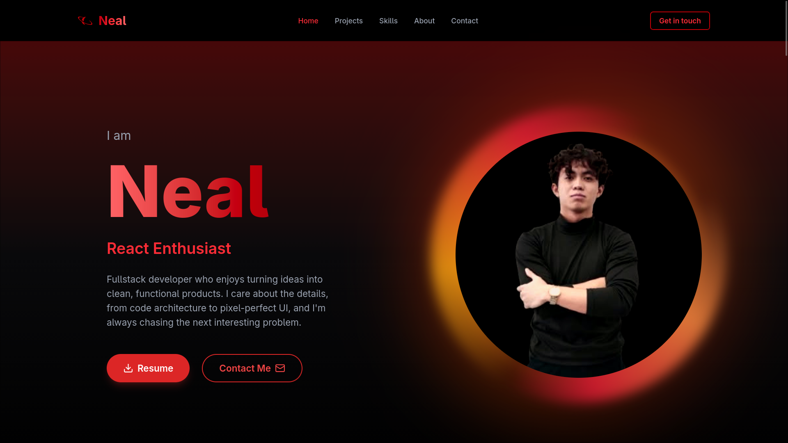

<div align="center">

# Christian Neal Paredes — Portfolio

A full-stack personal portfolio: a React/TypeScript frontend with a scroll-driven,
animated UI, backed by an Express API that stores contact messages in Postgres
and emails them out via Resend.

[](https://christiannealparedes.onrender.com/)


</div>

<p align="center">
  
</p>

## Overview

This repo is a monorepo with two independently deployable pieces:

| | |
|---|---|
| **`frontend/`** | Vite + React 19 + TypeScript single-page site. Framer Motion for scroll animations, Tailwind CSS 4 for styling. |
| **`backend/`** | Express 5 + TypeScript API. Persists contact form submissions to PostgreSQL and sends a notification email via [Resend](https://resend.com). |

The site is one long scroll made up of five sections — **Hero, Projects, Skills,
About, Contact** — plus a min-duration boot loader that waits for images before
revealing the page.

## Tech stack

- **Frontend:** React 19, TypeScript, Vite, Tailwind CSS 4, Framer Motion, React Icons, oxlint
- **Backend:** Node.js, Express 5, TypeScript, node-postgres (`pg`), Resend, tsx
- **Database:** PostgreSQL ([Neon](https://neon.tech) in production)
- **Infra:** Docker (backend), deployed on [Render](https://render.com)

## Project structure

```
portfolio/
├── frontend/
│   ├── public/              # static assets (project screenshots, photos, resume.pdf)
│   └── src/
│       ├── components/      # Navbar, Footer, Loader
│       ├── pages/           # hero/, projects/, skills/, about/, contact/
│       ├── data/            # projects.ts, skills.ts, panels.ts (content lives as data)
│       ├── services/        # contact.service.ts — talks to the backend API
│       ├── hooks/           # useScrollReveal
│       └── types/
└── backend/
    ├── Dockerfile
    └── src/
        ├── server.ts             # Express app, health/db-check routes
        ├── db.ts                 # pg Pool + table init
        ├── routes/contact.route.ts
        ├── controllers/contactController.ts
        └── providers/            # contact.provider.ts (DB), mailer.provider.ts (Resend)
```

## Getting started

Requires Node.js 22+ and a PostgreSQL database (a free [Neon](https://neon.tech) instance works well).

### Backend

```bash
cd backend
npm install
cp .env.example .env   # see Environment variables below
npm run dev             # tsx watch, http://localhost:<PORT>
```

### Frontend

```bash
cd frontend
npm install
cp .env.example .env   # see Environment variables below
npm run dev             # vite dev server
```

Other scripts (run inside `frontend/` or `backend/`):

| Command | Frontend | Backend |
|---|---|---|
| `npm run dev` | Vite dev server with HMR | `tsx watch` on `src/server.ts` |
| `npm run build` | Type-check + Vite build → `dist/` | `tsc` compile → `dist/` |
| `npm start` | — | Run compiled `dist/server.js` |
| `npm run lint` | oxlint | — |

### Environment variables

**`backend/.env`**

| Variable | Description |
|---|---|
| `DATABASE_URL` | Postgres connection string |
| `PGSSL` | Set when the DB requires SSL (e.g. Neon) |
| `PORT` | Port the API listens on |
| `NODE_ENV` | `development` / `production` — controls SSL behavior for `pg` |
| `CLIENT_ORIGIN` | Allowed CORS origin for the frontend |
| `RESEND_API_KEY` | API key from [Resend](https://resend.com) |
| `MAIL_TO` | Address that receives contact form submissions |

**`frontend/.env`**

| Variable | Description |
|---|---|
| `VITE_API_URL` | Base URL of the backend API, e.g. `http://localhost:5000/api` |

## API

| Method | Endpoint | Description |
|---|---|---|
| `GET` | `/api/health` | Liveness check |
| `GET` | `/api/db-check` | Verifies the database connection |
| `POST` | `/api/contact` | Body: `{ name, email, message }`. Saves the message to Postgres and emails it via Resend. |

On startup the backend creates the `messages` table if it doesn't already exist.

## Deployment

The backend ships as a multi-stage Docker image (`backend/Dockerfile`) — a
build stage compiles TypeScript, and the production stage runs only the
compiled output with production dependencies. Both services are deployed on
[Render](https://render.com), with Neon as the managed Postgres provider.

## Author

**Christian Neal Paredes**
[GitHub](https://github.com/ThomasDelamort) · [Live site](https://christiannealparedes.onrender.com/)
</content>
